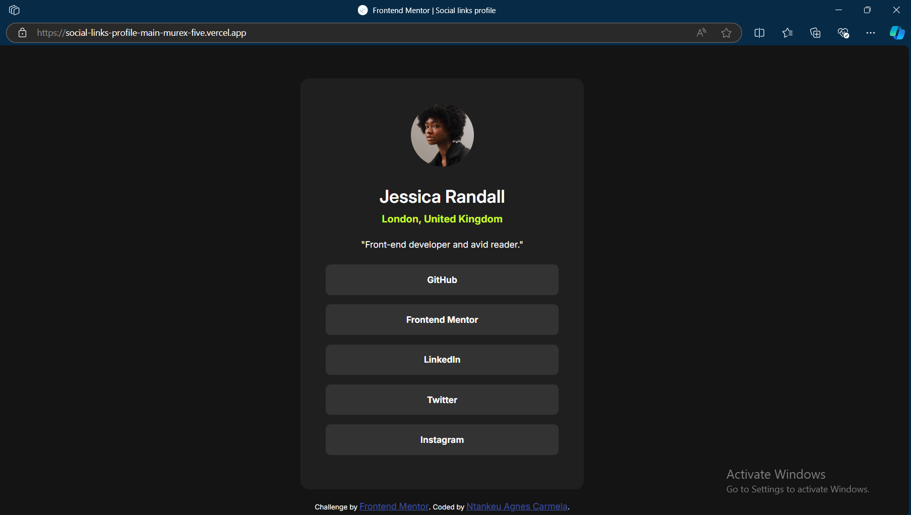

# Frontend Mentor - Social links profile solution

This is a solution to the [Social links profile challenge on Frontend Mentor](https://www.frontendmentor.io/challenges/social-links-profile-UG32l9m6dQ). Frontend Mentor challenges help you improve your coding skills by building realistic projects. 

## Table of contents

- [Overview](#overview)
  - [The challenge](#the-challenge)
  - [Screenshot](#screenshot)
  - [Links](#links)
- [My process](#my-process)
  - [Built with](#built-with)
  - [What I learned](#what-i-learned)
- [Author](#author)


## Overview

### The challenge

Users should be able to:

- See hover and focus states for all interactive elements on the page

### Screenshot



### Links

- Solution URL: (https://github.com/carmela925/social-links-profile-main)
- Live Site URL: (https://social-links-profile-main-murex-five.vercel.app/)

## My process

### Built with

- Semantic HTML5 markup
- CSS custom properties
- Flexbox


### What I learned
To see how you can add code snippets, see below:

```css
    .user{
      width: 85%;
      max-width: 450px;
      margin: auto;
      padding: 40px;
      border-radius: 14px;
      background-color: hsl(0, 0%, 12%);
      margin-bottom: 70px;
      transform: translateY(8%);
    }
```

## Author

- Website - (https://github.com/carmela925/)
- Frontend Mentor - [@yourusername](https://www.frontendmentor.io/profile/carmela925)